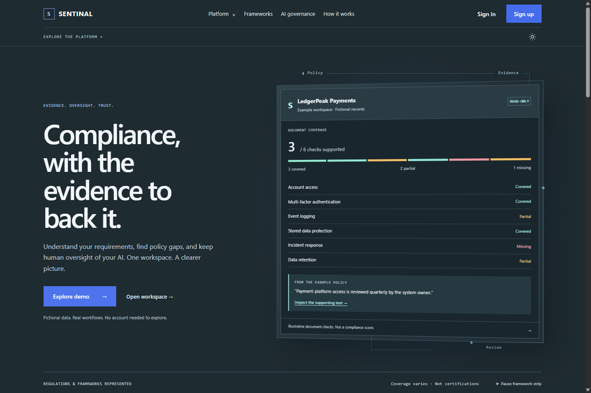
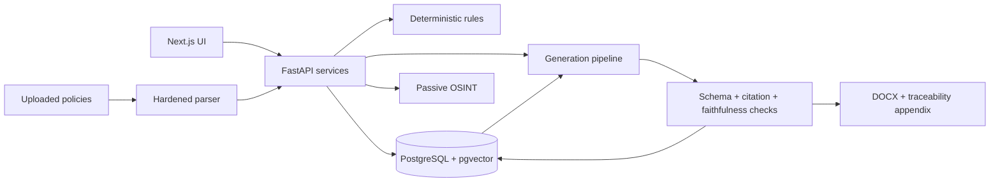

# Ruleset

Ruleset is a security-first GRC prototype that maps company facts and policy evidence to compliance controls, then generates traceable draft policies. The LLM is treated as untrusted: deterministic rules decide applicability, retrieval bounds citations, and verification rejects unsupported output.

> Draft compliance material only. Outputs require review by qualified legal, privacy, and security professionals.



## Current build

- 6 framework records, 4,233 controls, and 4,354 sourced crosswalk mappings
- NIST OSCAL and Secure Controls Framework ingestion with versioned controls
- Declarative HIPAA applicability rules with an auditable facts snapshot
- Encrypted uploads, constrained PDF/DOCX parsing, retention, and hard deletion
- Policy-to-control gap analysis with evidence-quote verification
- Passive OSINT for DNS, certificate transparency, and public website posture
- Structured Anthropic generation with citation, faithfulness, concurrency, retry, and token-budget guardrails
- DOCX policy export with a control traceability appendix
- Interactive tenant coverage matrix, framework drift detection, and a public trust page
- Read-only GitHub/AWS control monitoring with immutable evidence and pass-to-fail drift detection
- Grounded questionnaire answering, a risk register heatmap, and expiring Audit Hub shares
- Clerk-managed authentication with signed organization-to-RLS tenant mapping
- Authenticated intake and risk-management APIs with live Clerk-enabled UI modes
- 30-profile applicability evaluation set and 67 automated backend tests

The current golden set scores HIPAA applicability at 1.00 precision and 1.00 recall. Citation validity is structurally gated: a generated control ID must be present in the retrieved context before output can be stored.

## Architecture



PostgreSQL row-level security is the tenant-isolation backstop. Uploaded content, OSINT responses, and model output are all untrusted boundaries.

## Run locally

Prerequisites: Docker Desktop, Python 3.12, Node.js 22+, `uv`, and Corepack/pnpm.

```powershell
Copy-Item .env.example .env
```

Edit `.env` and replace both database passwords. Set `UPLOAD_MASTER_KEY_BASE64` to a securely generated 32-byte base64 key. `ANTHROPIC_API_KEY` and `VOYAGE_API_KEY` are optional until live generation or embeddings are used.

```powershell
docker compose up -d
Set-Location apps/api
python -m uv sync
python -m uv run alembic upgrade head
python -m uv run uvicorn ruleset.main:app --reload
```

In another terminal:

```powershell
corepack enable
pnpm install --frozen-lockfile
pnpm dev:web
```

Open `http://localhost:3000`. The API health endpoint is `http://localhost:8000/health`.

### Enable managed authentication

Create a Clerk application with Organizations enabled. Copy `apps/web/.env.example` to
`apps/web/.env.local`, then add the publishable and secret keys. In the root `.env`, add
the Clerk secret key, PEM JWT public key, and authorized frontend origins. Link a local
tenant once with the migration database role:

```sql
UPDATE orgs SET auth_provider_id = 'org_your_clerk_id' WHERE id = 'your-internal-org-uuid';
```

The API accepts session tokens only, verifies the JWT locally, checks its authorized
party, resolves the active Clerk organization through the database, and uses only the
resolved internal UUID for RLS. The public demo remains available when Clerk is unset.

## Verify

```powershell
Set-Location apps/api
python -m uv run pytest
python -m uv run ruff check .

Set-Location ../..
pnpm lint
pnpm typecheck
pnpm --filter web build
```

CI additionally runs migration checks, Bandit, Semgrep, Gitleaks, pip-audit, and pnpm audit.

## Security design

- Tenant-owned data carries `org_id` and is protected by PostgreSQL RLS.
- Uploads are magic-byte and size validated, encrypted per organization, parsed with resource limits, and hard-deleted with their engagement.
- OSINT is passive and public-records-only; URL fetching blocks private, loopback, link-local, and cloud-metadata destinations and revalidates redirects.
- Prompts delimit user-controlled data. Model output is length-capped and parsed with strict Pydantic schemas.
- Citation IDs and evidence quotes are checked deterministically instead of trusted to a model.
- Logs redact sensitive fields; secrets stay in environment/platform secret stores and are scanned in CI.

See [DATA_POLICY.md](DATA_POLICY.md), [THREAT_MODEL.md](THREAT_MODEL.md), and the in-app `/trust` page.

## Knowledge-base sources

- [NIST OSCAL content](https://github.com/usnistgov/oscal-content), including SP 800-53 Rev. 5
- [Secure Controls Framework](https://securecontrolsframework.com/), used for framework crosswalk identifiers

ISO standards text is not copied; only allowed identifiers and sourced mappings are stored.

## Known limits

- Clerk auth is wired but requires your Clerk application keys and one organization link before protected tenant APIs can be used.
- The rules catalog currently implements HIPAA applicability only.
- Live Anthropic generation and Voyage embeddings require API keys and have not been claimed as offline test results.
- Have I Been Pwned domain exposure is omitted because it requires a verified-domain API account.
- The homepage retains a seeded recruiter demo; authenticated routes provide live intake, uploads, posture checks, coverage, risks, monitoring evidence, questionnaire review, framework drift, policy exports, and expiring audit shares.
- Deployment and the roadmap's demo GIF/blog post remain packaging work.

## Repository map

```text
apps/api/              FastAPI services, migrations, and tests
apps/web/              Next.js coverage UI and trust page
packages/shared-types/ OpenAPI-derived contract destination
docker/                Local database initialization
```

The implementation roadmap is [grc-platform-build-roadmap.md](grc-platform-build-roadmap.md). `PROJECT.md` records the rebuilt repository state and conventions, not proof that a roadmap item is complete.
