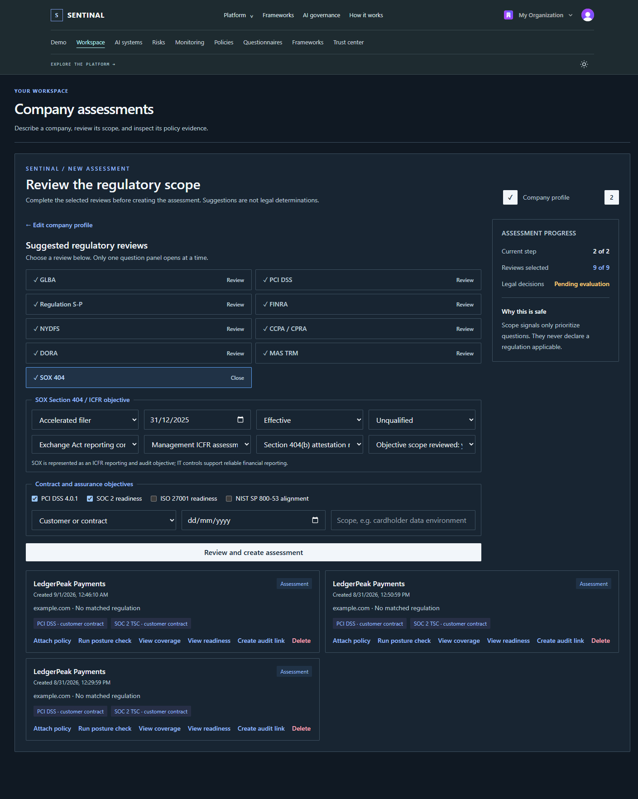
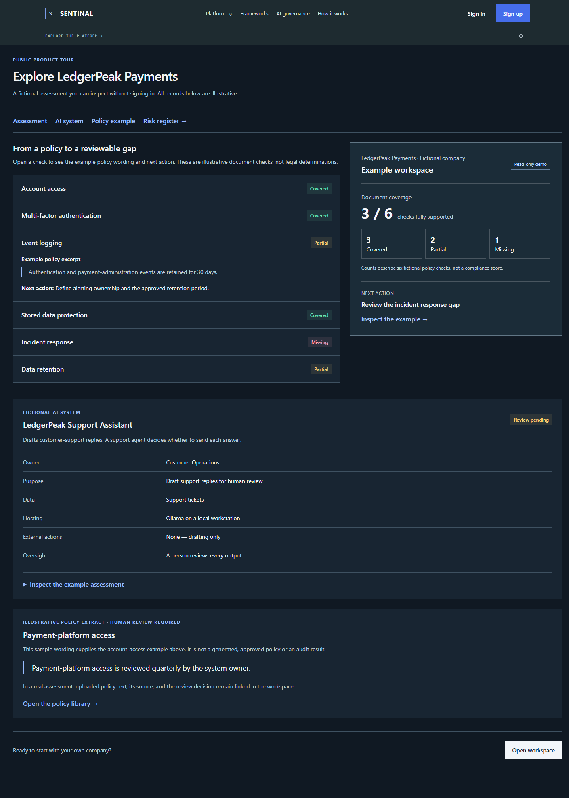
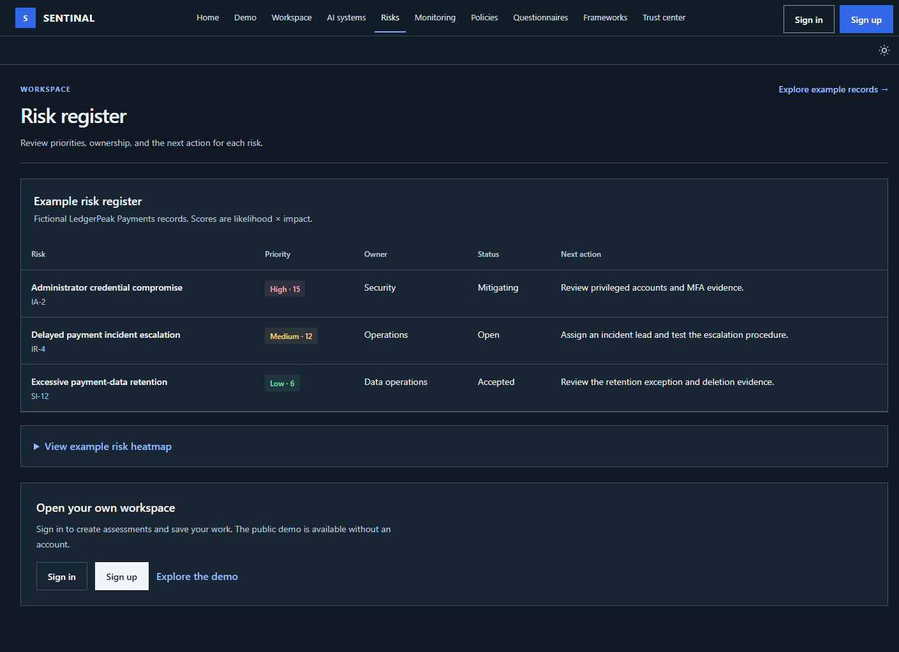
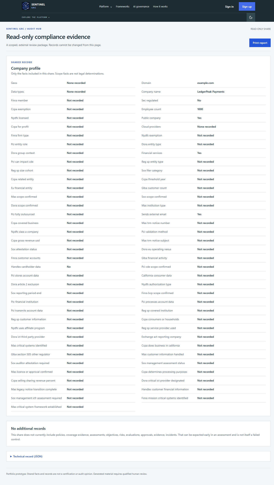
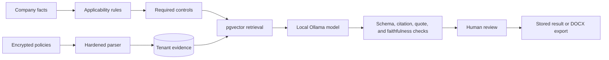
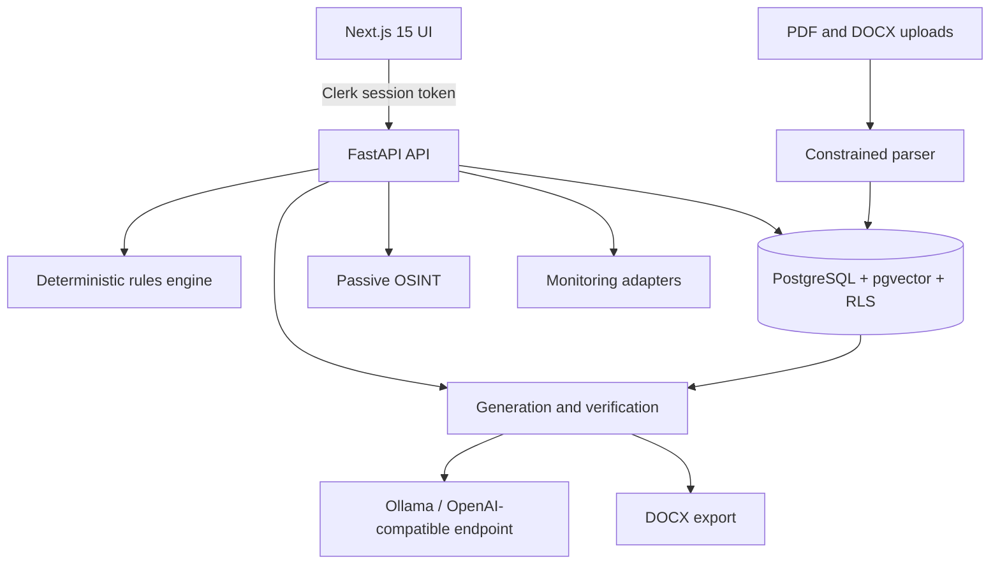

# GRC Sentinel

GRC Sentinel is an AI-assisted governance, risk, and compliance (GRC) platform prototype. It turns a company profile and its existing policy evidence into an auditable compliance workspace: applicable requirements, control coverage, evidence gaps, risks, draft policies, monitoring results, and auditor-ready exports.

The key design decision is that the language model never decides what legally applies and is never trusted to invent evidence. Deterministic rules establish applicability, retrieval limits the model's context, and verification rejects unsupported citations before output can be stored.

> Portfolio prototype—not legal advice, a certification, or an audit opinion. Generated compliance material requires qualified human review.

**[Open the live recruiter demo](https://grc-sentinel-slowgold05s-projects.vercel.app)** · **[Check API health](https://api-production-3fd2d.up.railway.app/health)** · **[Read the 90-second demo script](DEMO.md)**

## What a reviewer can see

The public homepage contains a fictional fintech engagement for **LedgerPeak Payments**, a source-linked US/EU/Singapore regulatory-perimeter view, and an interactive PCI DSS 4.0.1/SOC 2 control-coverage matrix. Select a control to inspect its exact policy evidence and remediation gap. The navigation demonstrates the risk register, continuous monitoring, questionnaire review, framework drift, policy library, and trust center.

The complete local build adds private document processing and local AI through Ollama. This split keeps the public portfolio inexpensive and prevents real policy text from being sent to a hosted model.

The completed black-and-red reviewer walkthrough is documented in [`screenshots/`](screenshots/README.md). It covers intake, control evidence, risks, monitoring, questionnaires, framework drift, policies, the trust center, and an expiring Audit Hub share.

To repeat the browser smoke test and authenticated screenshot walkthrough:

```powershell
Set-Location apps/api
python -m uv run python scripts/selenium_portfolio.py --headless
python -m uv run python scripts/selenium_portfolio.py --capture
```

The capture command opens an isolated Chrome session, pauses for Clerk sign-in and organization selection, uses only fictional LedgerPeak Payments data, and writes the ten reviewer images under `screenshots/`. The deployed Vercel-to-Railway flow passed this complete walkthrough on 1 September 2026.

| Intake and applicability | Evidence-backed coverage |
| --- | --- |
|  |  |
| **Risk register** | **Expiring Audit Hub share** |
|  |  |

| Capability | What GRC Sentinel does | Why it matters |
| --- | --- | --- |
| Company intake | Captures financial-data handling and confirmed regulator/status facts across the US, EU, and Singapore | Gives every decision a reproducible facts snapshot without asking AI to interpret legal status |
| Applicability | Evaluates versioned, declarative regulation rules and stores the facts used | Keeps legal applicability deterministic and testable |
| Assurance planning | Tracks SOC 2, ISO 27001, and NIST alignment separately from mandatory regulations | Avoids falsely presenting voluntary frameworks as laws |
| Control knowledge base | Ingests versioned NIST OSCAL and Secure Controls Framework records | Provides traceable control identifiers and mappings |
| Secure evidence upload | Validates, encrypts, parses, retains, and hard-deletes PDF/DOCX policies | Treats customer documents as hostile and sensitive input |
| RAG coverage analysis | Retrieves relevant policy sections and maps exact quotes to controls | Makes every coverage claim inspectable |
| Gap analysis | Classifies controls as covered, partial, or missing and recommends next steps | Turns policy evidence into an actionable remediation plan |
| Policy generation | Produces grounded drafts with control citations and DOCX traceability appendices | Speeds drafting without hiding the source controls |
| Questionnaire review | Generates evidence-backed answers that must be approved, edited, or rejected | Keeps a human in the decision loop |
| Risk register | Stores likelihood, impact, treatment state, and mapped controls in a heatmap | Connects compliance gaps to operational risk |
| Continuous monitoring | Runs read-only GitHub and AWS checks and stores immutable results | Detects when implemented safeguards drift from policy claims |
| Framework drift | Compares framework versions and identifies affected policy statements | Shows what must be reviewed when standards change |
| Audit Hub | Creates expiring read-only evidence shares and records access events | Supports scoped auditor collaboration |
| Trust center | Publishes implemented and planned safeguards with evidence | Demonstrates that the platform follows its own advice |
| Multi-tenancy | Maps Clerk organizations to internal tenant UUIDs protected by PostgreSQL RLS | Makes database isolation the final security boundary |

## End-to-end workflow

1. A user signs in through Clerk and creates or selects an organization.
2. GRC Sentinel provisions a tenant and stores only the resolved internal tenant UUID in database context.
3. The user describes the company and selects contractual or voluntary assurance objectives.
4. The deterministic rules engine evaluates which regulations apply and records the facts used.
5. The user uploads existing PDF or DOCX policies; GRC Sentinel validates, encrypts, and parses them into tenant-scoped sections.
6. Retrieval finds relevant policy sections for each required control.
7. Coverage analysis records exact supporting quotes and marks controls covered, partial, or missing.
8. The user reviews risks, remediation work, draft policies, and questionnaire answers.
9. Monitoring checks can create immutable evidence and flag pass-to-fail drift.
10. Approved material can be exported or shared through an expiring Audit Hub link.

## How the AI is constrained

GRC Sentinel uses retrieval-augmented generation (RAG), but deterministic software surrounds the model:



- Applicability is decided by declarative rules, not an LLM.
- Retrieved controls and policy sections bound the generation context.
- Pydantic schemas reject malformed output.
- Every generated control ID must exist in the retrieved context.
- Evidence quotes are checked against the source text.
- Unsupported or unfaithful output is rejected instead of silently stored.
- Generation has token budgets, retry limits, and concurrency controls.
- The default models run locally: `qwen3:14b` for generation and `mxbai-embed-large` for embeddings.

The reasoning behind this design is covered in [How GRC Sentinel rejects hallucinated citations](docs/hallucinated-citations.md).

## Architecture



| Layer | Technology | Responsibility |
| --- | --- | --- |
| Web | Next.js 15, React 19, Tailwind CSS | Responsive dashboard, Clerk UI, review workflows |
| API | FastAPI, Pydantic, SQLAlchemy | Validation, business rules, tenant APIs, generation orchestration |
| Data | PostgreSQL, pgvector, Alembic | Controls, evidence, vectors, audit history, RLS isolation |
| Identity | Clerk Organizations | Sign-in, organization membership, session verification |
| AI | Ollama with OpenAI-compatible APIs | Local generation and embeddings |
| Infrastructure | Docker Compose, Railway, Vercel | Reproducible local stack and public portfolio deployment |

## Framework and regulation coverage

The current knowledge base contains **6 framework records, 4,233 controls, 4,354 sourced crosswalk mappings, and 4,233 embeddings**. The production portfolio database was populated from the official SCF 2026.2 workbook using the same validated, idempotent importer; its import processed 1,534 SCF controls and 4,354 selected mappings.

- NIST SP 800-53 Rev. 5 controls come from official [NIST OSCAL content](https://github.com/usnistgov/oscal-content).
- Cross-framework identifiers come from the [Secure Controls Framework](https://securecontrolsframework.com/).
- PCI DSS 4.0.1 and SOC 2 provide the sourced cross-framework view used by the fintech demo.
- A HIPAA ruleset currently provides the executable applicability proof-of-concept and 30-profile evaluation set; new legal rules remain inactive until their source review and golden evaluation set are approved.
- SOC 2, ISO 27001, and NIST are modeled as contractual or voluntary assurance objectives.
- ISO standards text is not copied; the repository stores permitted identifiers and sourced mappings only.

The current applicability golden set scores **1.00 precision and 1.00 recall**. The integrity check reports zero orphaned crosswalks. SCF does not currently provide a NIST path for SOC privacy criteria `P6.0` and `P6.4`; GRC Sentinel records those source-level gaps rather than inventing mappings.

The source-backed candidate conditions and their activation checklist are documented in the [fintech applicability review package](docs/fintech-applicability-review.md). The [full fintech implementation roadmap](docs/fintech-full-implementation-roadmap.md) defines the work required to activate each regime end to end. They remain deliberately inactive until human review approves the legal scope, exclusions, and golden profiles.

### Fintech regulatory perimeter

These are not treated as interchangeable frameworks. The intake stores explicit scope facts, the UI links to the issuing authority, and the product distinguishes a regulation from a contractual standard, an SRO rule, or an audit obligation.

| Regime | Classification | Deterministic scope signal captured | Product status | Primary source |
| --- | --- | --- | --- | --- |
| GLBA Safeguards Rule, 16 CFR Part 314 | US federal regulation | FTC-covered financial institution + customer information | Scope captured; executable rule awaiting human review | [FTC rule and coverage guidance](https://www.ftc.gov/business-guidance/resources/ftc-safeguards-rule-what-your-business-needs-know) |
| PCI DSS 4.0.1 | Contractual industry standard | Payment account data stored, processed, or transmitted | Installed control catalog, sourced crosswalks, demo readiness objective | [PCI SSC document library](https://www.pcisecuritystandards.org/document_library/) |
| SEC Regulation S-P | US federal securities rule | Covered broker-dealer, investment company/adviser, funding portal, or transfer agent | Scope captured; executable rule awaiting human review | [SEC final rule](https://www.sec.gov/rules-regulations/2024/06/s7-05-23) |
| FINRA Rule 4370 | SRO rule | FINRA member firm | Scope captured; executable rule awaiting human review | [FINRA BCP guidance](https://www.finra.org/rules-guidance/key-topics/business-continuity-planning) |
| 23 NYCRR Part 500 | New York regulation | Entity operating under a covered NYDFS authorization | Scope captured; exemptions require separate review | [NYDFS Cybersecurity Resource Center](https://www.dfs.ny.gov/industry_guidance/cybersecurity) |
| SOX Section 404 | Reporting and audit requirement | Company subject to Exchange Act periodic reporting | Scope captured as an ICFR/audit objective | [SEC Section 404 rule](https://www.sec.gov/rules-regulations/2003/03/managements-report-internal-control-over-financial-reporting-certification-disclosure-exchange-act) |
| CCPA / CPRA | California privacy law | Business confirms it meets current statutory threshold(s) and processes California personal information | Scope captured; thresholds/exemptions require review | [California Privacy Protection Agency FAQ](https://cppa.ca.gov/faq) |
| DORA, Regulation (EU) 2022/2554 | EU regulation | Article 2 category, exclusions, EU nexus, group context, ICT-provider role, and critical designation captured separately | Detailed scope foundation; executable rule awaiting human review | [EUR-Lex text](https://eur-lex.europa.eu/legal-content/EN/TXT/?uri=CELEX:32022R2554) |
| MAS Technology Risk Management Notices | Singapore regulatory notices | Institution category, licence/approval, exact FSM notice, transition, and critical-system facts | Detailed scope foundation; executable rule awaiting human review | [MAS Notice on TRM FAQ](https://www.mas.gov.sg/-/media/mas-media-library/regulation/faqs/trpd/faqs---notice-on-technology-risk-management/faqs---notice-on-trm/faq---notice-on-technology-risk-management.pdf) |

Two timing details are intentionally precise: the FTC's 30-day notice applies to qualifying notification events involving at least 500 consumers' unencrypted customer information, not every breach; and 31 March 2025 was when PCI DSS v4.x future-dated requirements became effective, not when the entire standard first became mandatory.

## Security model

- Every tenant-owned row carries `org_id` and is protected by forced PostgreSQL row-level security.
- The runtime API uses a restricted database role; an owner connection is reserved for migrations.
- Clerk session tokens are verified server-side, including authorized-party checks.
- Clerk organization IDs are resolved to internal UUIDs before database access.
- Uploads are size- and magic-byte-validated, encrypted per tenant, and parsed with resource limits.
- URL fetching blocks private, loopback, link-local, and cloud-metadata destinations and revalidates redirects.
- Prompts clearly delimit user-controlled text and model output is length-capped and schema-validated.
- Audit evidence is append-only; audit-share links expire and can be revoked.
- Logs redact sensitive fields, and secrets remain in ignored local files or hosting secret stores.
- CI runs tests, migration checks, Bandit, Semgrep, Gitleaks, dependency audits, and frontend checks.

See [DATA_POLICY.md](DATA_POLICY.md), [THREAT_MODEL.md](THREAT_MODEL.md), and the live `/trust` page for the detailed boundaries.

## Tests and measurable checks

- 89 automated backend tests
- 30 regulation-applicability evaluation profiles
- Property-based rules-engine tests
- Migration head checks
- Knowledge-base crosswalk integrity checks
- Frontend ESLint, TypeScript, and production-build validation
- Static analysis and secret/dependency scanning in CI

```powershell
Set-Location apps/api
python -m uv run pytest
python -m uv run ruff check .

Set-Location ../web
npm run lint
$env:VERCEL='1'; npm run build
```

## Run the full stack locally

Prerequisites: Docker Desktop, Python 3.12, Node.js 22+, `uv`, Corepack/pnpm, and Ollama.

```powershell
Copy-Item .env.example .env
```

Replace the example database passwords and generate a 32-byte base64 `UPLOAD_MASTER_KEY_BASE64`. Then install the local models and start the database:

```powershell
ollama pull qwen3:14b
ollama pull mxbai-embed-large
docker compose up -d
```

Prepare and start the API:

```powershell
Set-Location apps/api
python -m uv sync
python -m uv run alembic upgrade head
python -m uv run python -m ruleset.kb.embed_controls
python -m uv run uvicorn ruleset.main:app --reload
```

Start the web app in another terminal:

```powershell
corepack enable
pnpm install --frozen-lockfile
pnpm dev:web
```

Open `http://localhost:3000`; API health is at `http://localhost:8000/health`.

### Authentication

The hosted demo already uses the linked Clerk development instance. For a new local setup:

```powershell
Set-Location apps/web
clerk auth login
clerk init --app app_3IfQoM1pXe4hwChImmzYNgNVqha
clerk enable orgs --app app_3IfQoM1pXe4hwChImmzYNgNVqha --instance dev --force-selection --auto-create --max-members 5 --yes
clerk doctor
```

Email authentication is sufficient. Google and GitHub are optional sign-in conveniences and require provider configuration for a production Clerk instance.

## Deployment

The portfolio deployment uses:

- **Vercel:** public Next.js interface
- **Railway:** FastAPI and PostgreSQL/pgvector
- **Clerk:** development authentication and Organizations
- **Local laptop:** Ollama inference for the private full-stack demonstration

The public homepage is seeded so reviewers can explore the product without uploading data. Authenticated tenant workflows use the hosted API, while local Ollama-dependent generation remains a local demonstration to avoid GPU hosting cost and third-party policy disclosure.

See [DEPLOYMENT.md](DEPLOYMENT.md) for configuration, migration, and smoke-test details. Production Dockerfiles are included for both applications.

## Repository map

```text
apps/api/                 FastAPI source, migrations, ingestion, and tests
apps/web/                 Next.js dashboard and Clerk-authenticated workflows
docker/                   Least-privilege local PostgreSQL initialization
docs/                     Technical design notes
packages/shared-types/    OpenAPI-derived contract destination
screenshots/              Reviewer walkthrough images
```

The implementation plan is documented in [grc-platform-build-roadmap.md](grc-platform-build-roadmap.md). `PROJECT.md` records repository conventions and rebuilt state.

## Current limitations

- This is a portfolio prototype, not a compliance determination service.
- Executable legal-applicability rules currently use HIPAA as the proof-of-concept. The fintech intake captures GLBA, Regulation S-P, FINRA, NYDFS, SOX, CCPA/CPRA, DORA, and MAS scope facts, but does not claim they apply until a human-reviewed ruleset and evaluation set are approved.
- The public deployment does not host Ollama. Run locally for private generation and embeddings.
- GitHub and AWS monitoring require explicitly scoped, read-only credentials.
- Have I Been Pwned domain exposure is omitted because it requires a verified-domain API account.
- Human approval remains mandatory for generated policies and questionnaire answers.
