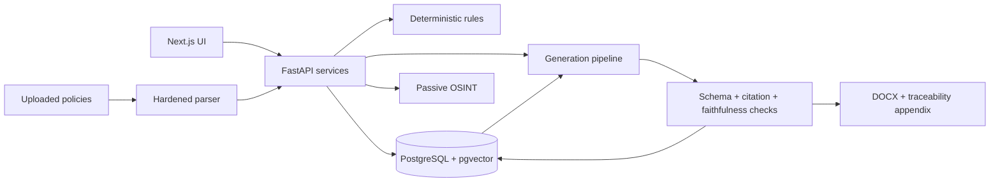

# Ruleset

Ruleset is a security-first GRC prototype that maps company facts and policy evidence to compliance controls, then generates traceable draft policies. The LLM is treated as untrusted: deterministic rules decide applicability, retrieval bounds citations, and verification rejects unsupported output.

> Draft compliance material only. Outputs require review by qualified legal, privacy, and security professionals.

**Live recruiter demo:** https://web-slowgold05s-projects.vercel.app


## Current build

- 6 framework records, 4,233 controls, 4,354 sourced crosswalk mappings, and 4,233 embeddings
- NIST OSCAL and Secure Controls Framework ingestion with versioned controls
- Declarative HIPAA applicability rules with an auditable facts snapshot
- Contractual and voluntary assurance objectives for SOC 2, ISO 27001, and NIST SP 800-53
- Encrypted uploads, constrained PDF/DOCX parsing, retention, and hard deletion
- Policy-to-control gap analysis with evidence-quote verification
- Passive OSINT for DNS, certificate transparency, and public website posture
- Local Ollama generation with citation, faithfulness, concurrency, retry, and token-budget guardrails
- DOCX policy export with a control traceability appendix
- Interactive tenant coverage matrix, framework drift detection, and a public trust page
- Read-only GitHub/AWS control monitoring with immutable evidence and pass-to-fail drift detection
- Grounded questionnaire answering, a risk register heatmap, and expiring Audit Hub shares
- Clerk-managed authentication with signed organization-to-RLS tenant mapping
- Authenticated intake and risk-management APIs with live Clerk-enabled UI modes
- Project-local agent guardrails plus a source-first control-building skill
- 30-profile applicability evaluation set and 71 automated backend tests

The current golden set scores HIPAA applicability at 1.00 precision and 1.00 recall. Citation validity is structurally gated: a generated control ID must be present in the retrieved context before output can be stored. The knowledge-base integrity check finds zero orphaned crosswalks; SCF currently provides no NIST path for two SOC privacy criteria (`P6.0`, `P6.4`).

## Architecture



PostgreSQL row-level security is the tenant-isolation backstop. Uploaded content, OSINT responses, and model output are all untrusted boundaries.

## Run locally

Prerequisites: Docker Desktop, Python 3.12, Node.js 22+, `uv`, and Corepack/pnpm.

```powershell
Copy-Item .env.example .env
```

Edit `.env` and replace both database passwords. Set `UPLOAD_MASTER_KEY_BASE64` to a securely generated 32-byte base64 key. Install Ollama, then download the two local models:

```powershell
ollama pull qwen3:14b
ollama pull mxbai-embed-large
Set-Location apps/api
python -m uv run python -m ruleset.kb.embed_controls
```

Generation defaults to Ollama. To demonstrate hosted reasoning instead, set
`LLM_BASE_URL=https://openrouter.ai/api/v1`, add `LLM_API_KEY`, and set both LLM model
variables to `z-ai/glm-5.3-flash`. Embeddings remain local through Ollama.

```powershell
docker compose up -d
Set-Location apps/api
python -m uv sync
python -m uv run alembic upgrade head
python -m uv run uvicorn ruleset.main:app --reload
```

In another terminal:

```powershell
corepack enable
pnpm install --frozen-lockfile
pnpm dev:web
```

Open `http://localhost:3000`. The API health endpoint is `http://localhost:8000/health`.

### Enable managed authentication

Link the existing Clerk application from the Next.js app directory. The CLI writes its
development keys to the ignored `apps/web/.env.local`; FastAPI reads the same private file
locally, so keys do not need to be copied:

```powershell
Set-Location apps/web
clerk auth login
clerk init --app app_3IfQoM1pXe4hwChImmzYNgNVqha
clerk doctor
```

Enable Organizations plus email, Google, and GitHub sign-in in the Clerk dashboard. A
verified Clerk organization is provisioned as an isolated local tenant on its first API
request; no manual database link is required.

The API accepts session tokens only, verifies them through Clerk's backend SDK, checks the
authorized party, resolves the active Clerk organization through the database, and uses
only the resolved internal UUID for RLS. The public demo remains available when Clerk is unset.

## Verify

```powershell
Set-Location apps/api
python -m uv run pytest
python -m uv run ruff check .

Set-Location ../..
pnpm lint
pnpm typecheck
pnpm --filter web build
```

CI additionally runs migration checks, Bandit, Semgrep, Gitleaks, pip-audit, and pnpm audit.

## Deploy

Production Dockerfiles are provided for both apps and use the repository root as build context:

```powershell
docker build -f apps/api/Dockerfile -t ruleset-api .
docker build -f apps/web/Dockerfile -t ruleset-web .
```

Run `alembic upgrade head` as the API release command with `MIGRATION_DATABASE_URL`, then start
the API container with its runtime secrets. Next.js public variables are build arguments because
they are embedded in the browser bundle. A hosted API can use an OpenAI-compatible provider;
the local portfolio setup keeps policy text on-device through Ollama.

See [DEPLOYMENT.md](DEPLOYMENT.md) for the Vercel, Railway, Clerk, migration, and smoke-test checklist.

## Security design

- Tenant-owned data carries `org_id` and is protected by PostgreSQL RLS.
- Uploads are magic-byte and size validated, encrypted per organization, parsed with resource limits, and hard-deleted with their engagement.
- OSINT is passive and public-records-only; URL fetching blocks private, loopback, link-local, and cloud-metadata destinations and revalidates redirects.
- Prompts delimit user-controlled data. Model output is length-capped and parsed with strict Pydantic schemas.
- Citation IDs and evidence quotes are checked deterministically instead of trusted to a model.
- Logs redact sensitive fields; secrets stay in environment/platform secret stores and are scanned in CI.

See [DATA_POLICY.md](DATA_POLICY.md), [THREAT_MODEL.md](THREAT_MODEL.md), and the in-app `/trust` page.

## Knowledge-base sources

- [NIST OSCAL content](https://github.com/usnistgov/oscal-content), including SP 800-53 Rev. 5
- [Secure Controls Framework](https://securecontrolsframework.com/), used for framework crosswalk identifiers

ISO standards text is not copied; only allowed identifiers and sourced mappings are stored.

## Known limits

- Clerk development auth is linked; sign in and create or select an organization to use protected tenant APIs.
- The rules catalog currently implements HIPAA applicability only.
- SOC 2, ISO 27001, and NIST are selected assurance objectives, not represented as laws that automatically apply.
- Local Ollama generation and embeddings require the configured models to be downloaded and Ollama to be running. Optional OpenRouter generation sends prompt content to its provider.
- Have I Been Pwned domain exposure is omitted because it requires a verified-domain API account.
- The homepage retains a seeded recruiter demo; authenticated routes provide live intake, uploads, posture checks, coverage, risks, monitoring evidence, questionnaire review, framework drift, policy exports, and expiring audit shares.
- Deployment and the roadmap's demo GIF/blog post remain packaging work.

## Repository map

```text
apps/api/              FastAPI services, migrations, and tests
apps/web/              Next.js coverage UI and trust page
packages/shared-types/ OpenAPI-derived contract destination
docker/                Local database initialization
```

The implementation roadmap is [grc-platform-build-roadmap.md](grc-platform-build-roadmap.md). `PROJECT.md` records the rebuilt repository state and conventions, not proof that a roadmap item is complete.

For a concise walkthrough, use the [90-second demo script](DEMO.md).
The accompanying article explains [how unsupported citations are structurally rejected](docs/hallucinated-citations.md).
