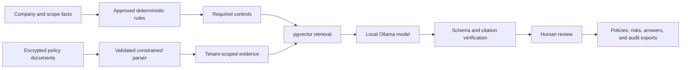

# GRC Sentinel interview guide

Use this document to explain the project clearly in interviews. Do not memorize every sentence.
Learn the story, then describe it naturally.

## The 30-second explanation

> GRC Sentinel is an AI-assisted governance, risk, and compliance platform for fintech companies.
> A company enters facts about its business, regulatory exposure, and security program. The
> platform records those facts, evaluates approved applicability rules, maps requirements to a
> source-backed control knowledge base, analyzes uploaded policies for evidence and gaps, and
> produces reviewable policy drafts and audit material. The important design decision is that AI
> never decides what law applies and cannot invent control citations. Deterministic rules and
> verification handle those high-risk decisions, while a local Ollama model only helps with
> bounded drafting and analysis.

## The two-minute explanation

GRC work is difficult because companies must answer several connected questions:

1. Which obligations or assurance frameworks are relevant?
2. Which security controls support those obligations?
3. What evidence shows that the controls are covered?
4. What is missing, and what should be fixed first?
5. How can the result be explained to an auditor or customer?

GRC Sentinel joins those steps into one workflow. A user signs in with Clerk and works inside an
organization protected by PostgreSQL row-level security. During intake, the platform captures
detailed facts for regimes such as GLBA, PCI DSS, Regulation S-P, FINRA, NYDFS, CCPA/CPRA, DORA,
MAS TRM, and SOX 404. Approved deterministic rules can return `applicable`, `not_applicable`, or
`needs_review`; the model is not involved in that decision.

The knowledge base contains NIST controls imported from OSCAL and sourced cross-framework
mappings imported from the Secure Controls Framework. When a user uploads a PDF or DOCX policy,
the platform validates and encrypts it, extracts its text in a constrained parser, and retrieves
sections relevant to required controls. Coverage results are classified as covered, partial, or
missing and must point to exact evidence.

Ollama can help draft structured policy statements, but every cited control ID must have been in
the retrieval context. Deterministic verification rejects unsupported citations. The result is a
reviewable compliance workspace containing coverage, gaps, risks, monitoring evidence, policies,
questionnaire answers, and expiring auditor shares.

## The problem I was solving

Many AI compliance demos ask a model to read a regulation and decide what a company must do. That
is unreliable and difficult to audit. A hallucinated legal conclusion or control citation can be
more harmful than no answer.

My approach was to make the model the least-trusted component:

- Deterministic rules decide approved applicability.
- Official or licensed sources populate the control knowledge base.
- Retrieval limits what the model is allowed to use.
- Schemas constrain the output format.
- Code verifies citations and evidence before storage.
- A human still approves legal scope and generated compliance material.

The main engineering lesson is that AI safety came from system design, not from hoping the model
would always answer correctly.

## How the system works

### Frontend

The Next.js interface provides intake, coverage, risks, monitoring, questionnaires, policy
exports, framework drift, the trust center, and the Audit Hub. Clerk provides authentication and
organization membership.

### Backend

FastAPI validates requests with Pydantic models and coordinates deterministic rules, document
processing, retrieval, generation, monitoring, retention, and audit-sharing services.

### Database and tenancy

PostgreSQL stores relational records and pgvector embeddings. Every tenant-owned table carries an
organization ID and uses forced row-level security. The API sets the current organization in the
database transaction, so a missing application filter should not expose another tenant's data.

### Knowledge base

NIST SP 800-53 controls come from official OSCAL content. Cross-framework identifiers and mappings
come from the Secure Controls Framework. ISO text is not copied because of licensing restrictions;
only permitted identifiers and provenance are stored.

### AI and RAG

The local Ollama setup uses `mxbai-embed-large` for embeddings and `qwen3:14b` for generation. RAG
retrieves only relevant controls and evidence. The model returns structured data rather than free-
form trusted output. Unsupported control IDs and evidence claims are rejected.

## What is genuinely implemented

- Clerk authentication and organization-based tenancy
- PostgreSQL row-level security
- Detailed fintech intake and immutable fact snapshots
- Three-state applicability classification
- HIPAA executable applicability proof of concept and evaluation set
- Detailed candidate foundations for nine fintech regimes
- NIST OSCAL and SCF knowledge-base ingestion
- PCI DSS and SOC 2 sourced cross-framework demo data
- Encrypted PDF/DOCX upload and constrained parsing
- RAG-based coverage and gap analysis
- Verified policy generation and DOCX traceability export
- Risk register and heatmap
- Read-only GitHub and AWS monitoring with immutable evidence
- Questionnaire review workflow
- Framework-version drift analysis
- Expiring read-only Audit Hub links
- Retention enforcement and hard deletion
- Automated tests and security checks in GitHub Actions

## What is not yet claimed

The detailed GLBA, PCI DSS, Regulation S-P, FINRA, NYDFS, CCPA/CPRA, DORA, MAS TRM, and SOX
intakes are not automatically treated as final legal determinations. Activating each regime still
requires qualified review of scope, exclusions, effective dates, citations, requirement sources,
control mappings, and golden evaluation profiles.

This is an intentional trust boundary, not a missing AI prompt. The portfolio demonstrates the
engineering foundation while avoiding unsupported legal claims.

## Best demo sequence

1. Open the homepage and explain the fictional LedgerPeak Payments fintech profile.
2. Show that regulations, SRO rules, reporting objectives, and contractual frameworks are labeled
   separately.
3. Open the coverage matrix and select covered, partial, and missing controls.
4. Point to the exact evidence quote and remediation gap.
5. Explain how RAG retrieves evidence and how deterministic verification blocks invented control
   citations.
6. Show the risk register and connect a compliance gap to operational risk.
7. Show monitoring and explain immutable evidence plus pass-to-fail drift.
8. Finish with the trust center or an expiring Audit Hub share.

The closing sentence can be:

> The project is not impressive because an LLM writes policies. It is useful because every
> important AI output is constrained, traceable, tenant-isolated, and reviewable.

## Likely interview questions

### Why did you build this?

I wanted a project that combined cybersecurity, compliance, backend engineering, data modeling,
and practical AI safety. GRC was a good fit because explainability and evidence matter more than a
confident natural-language answer.

### Why not let the model determine applicable regulations?

Legal applicability must be reproducible and auditable. A deterministic rule can be versioned,
tested against positive and negative profiles, and tied to the exact input facts. A model response
can change with the prompt or model version and may invent legal reasoning.

### How do you prevent hallucinated citations?

The generator receives a bounded retrieval context containing allowed control IDs. Its output is
parsed into a Pydantic schema. A deterministic verifier compares every cited ID with the allowed
set and rejects the output if any citation is unsupported. The model cannot authorize its own
citation.

### Where does RAG fit?

RAG retrieves relevant controls and uploaded policy sections before generation or coverage
analysis. It improves relevance and limits the model's context. It does not establish legal
applicability or prove that two frameworks are equivalent.

### Why use Ollama?

Ollama allows policy content to remain local, avoids per-request API cost, and works well for a
portfolio deployment with capable laptop hardware. The provider is replaceable through an
OpenAI-compatible boundary, but local generation is the default privacy story.

### How is tenant data isolated?

Clerk authenticates the user and organization. The API resolves the provider organization to an
internal UUID and sets it in the PostgreSQL transaction. Forced row-level-security policies use
that value on tenant tables. This makes the database—not a developer remembering every query
filter—the final isolation boundary.

### How do you secure uploaded policies?

The platform checks file size and magic bytes, encrypts stored content, parses it with resource
limits, treats extracted text as untrusted prompt data, avoids logging document content, and
hard-deletes engagement data according to the retention policy.

### Where do the controls and mappings come from?

NIST controls come from official OSCAL content. Cross-framework mappings come from the Secure
Controls Framework importer. The project does not create a mapping just because two controls sound
similar. ISO content is restricted to permitted identifiers and provenance.

### Why PostgreSQL and pgvector together?

The project needs transactional tenant data, audit history, row-level security, and vector search.
PostgreSQL plus pgvector provides all four without adding another database or synchronization path.

### What was the hardest engineering problem?

The hardest part was defining trust boundaries across legal scope, uploaded evidence, model output,
tenant data, and external systems. The solution was to keep high-risk decisions deterministic,
make evidence immutable or traceable, and put validation at every boundary.

### What would you build next?

The next step is not another UI feature. It is qualified review and activation of one fintech
regime at a time: approved source version, executable rules, requirement import, sourced mappings,
30 or more golden profiles, API persistence tests, and authenticated browser verification.

### How do you know the project works?

The repository currently has 92 backend tests plus property-based rule tests, frontend lint and
type checks, knowledge-base integrity validation, Selenium browser coverage, migration checks,
Bandit, Semgrep, Gitleaks, and Python/JavaScript dependency audits in CI.

## Engineering trade-offs to discuss

| Decision | Benefit | Trade-off |
| --- | --- | --- |
| Deterministic applicability | Reproducible and auditable | Rules require careful human review and maintenance |
| Local Ollama | Privacy and no usage cost | Laptop resources and slower generation |
| PostgreSQL + pgvector | One secure transactional data platform | Vector scale is lower than a specialized service |
| Managed Clerk authentication | Avoids hand-built identity security | External identity dependency |
| SCF-sourced mappings | Traceable and broad framework coverage | Source gaps remain visible and cannot be guessed away |
| Human approval gates | Prevents unsupported legal claims | Slower framework activation |

## Strong resume talking points

- Designed a deterministic, three-state compliance applicability engine with immutable fact
  snapshots and human-reviewed versioned rules.
- Built a source-backed control knowledge base from NIST OSCAL and SCF with PostgreSQL/pgvector
  retrieval and integrity validation.
- Implemented a local Ollama RAG pipeline with schema validation and deterministic rejection of
  hallucinated control citations.
- Enforced multi-tenant isolation using Clerk Organizations and forced PostgreSQL row-level
  security.
- Built encrypted policy ingestion, evidence-backed gap analysis, verified policy exports,
  immutable monitoring evidence, and expiring audit shares.
- Added CI gates for tests, migrations, linting, type checking, static analysis, secret scanning,
  and dependency vulnerabilities.

## Terms to know

- **GRC:** Governance, risk, and compliance.
- **Control:** A security requirement such as NIST `AC-2`.
- **Crosswalk:** A sourced relationship between controls in different frameworks.
- **Applicability determination:** A versioned result explaining why an approved regulation rule
  matched a company profile.
- **Assurance objective:** A voluntary or contractual goal such as SOC 2 or ISO 27001 readiness.
- **RAG:** Retrieval-augmented generation; relevant source material is retrieved before the model
  generates an answer.
- **OSCAL:** NIST's machine-readable format for security control catalogs.
- **RLS:** PostgreSQL row-level security, used here as the tenant-isolation enforcement layer.
- **ICFR:** Internal control over financial reporting, the focus of SOX Section 404.
- **Golden evaluation set:** Human-reviewed positive, negative, exemption, boundary, and unknown
  profiles used to measure deterministic rule behavior.

## Final interview advice

Lead with the problem and trust model, not the list of technologies. Explain one end-to-end user
journey, then go deeper only when asked. Be direct about what is implemented and what still needs
qualified legal review. That honesty strengthens the architecture story: the system is designed to
know when it must stop and ask a human.
